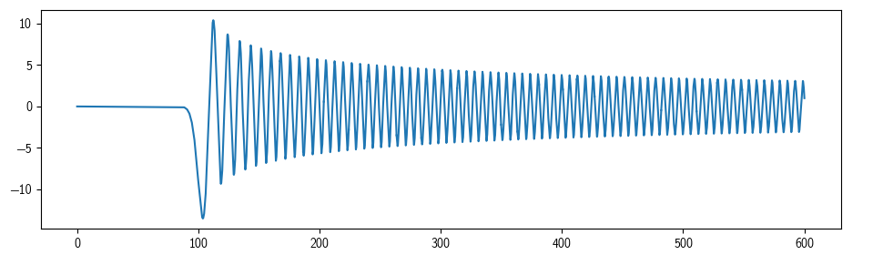

# A fast adaptive numerical method for stiff two-point boundary value problems

This repo contains a python implementation of the algorithm detailed in [this paper](https://math.nyu.edu/~greengar/lee_gr_tpbvp.pdf). It handles second order linear differential equations of the form $u''(x) + p(x) u'(x) + q(x) u(x) = f(x)$ under the boundary conditions $A u'(a) + B u(a) = C$, $D u'(b) + E u(b) = F$.

Example usage:

```python
import matplotlib.pyplot as plt
import numpy as np

from Solver import Solver

Solver.Local.initialize(16,4,1e-5)

solver = Solver.Solver(0, 600,
                    lambda x: 1/x,
                    lambda x: 1 - (100/x)**2,
                    lambda x: np.zeros_like(x),
                    1, 0, 1, 0, 0, 1)

x, u, du = solver.solve()
plt.plot(x, u)
plt.show()
```



For more detail read the docstring of `Solver.Solver`.

## Newton's method

There is additionally a simple Newton's iteration algorithm implemented on top of the linear solver. It solves equations of the form $u''(x) = f(x, u(x), u'(x))$.

```python
from Solver import Nonlinear
Solver.Local.initialize(16,4,3e-5)

# sn(x), m=0.5
EllipticK = 1.8540746773013719184338503471952600462175988235217669055859
xs, u, du, ddu = Nonlinear.newton(0, EllipticK,
                 lambda x, y, dy: y**3 - 1.5*y,
                 lambda x, y, dy: 3*y**2 - 1.5,
                 lambda x, y, dy: np.zeros_like(x),
                 1, 0, 1, 0, 0, 1)
plt.plot(xs, u)
plt.show()
```
